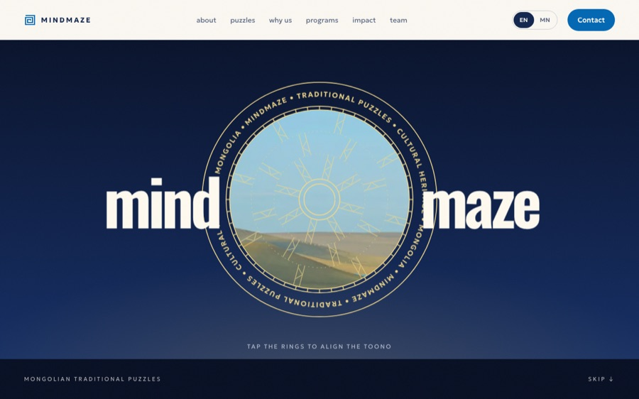
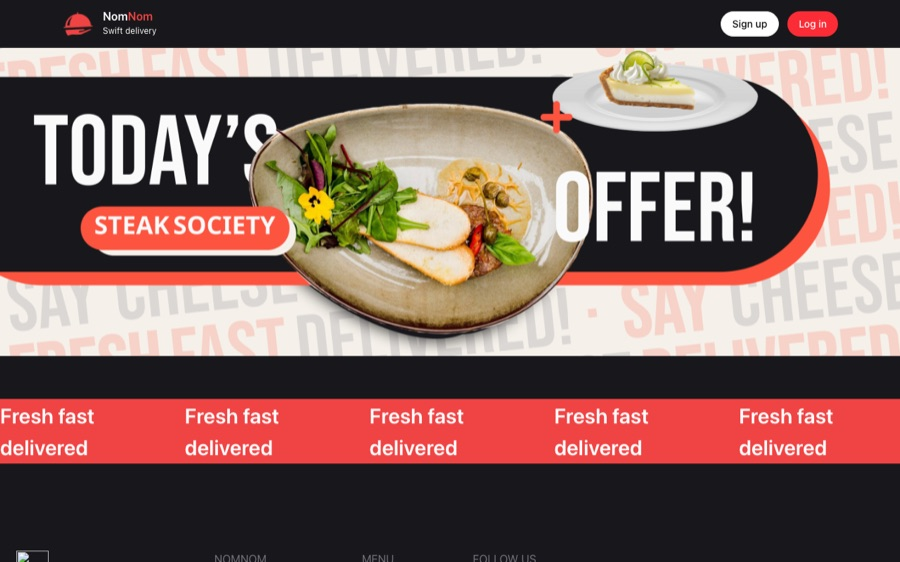
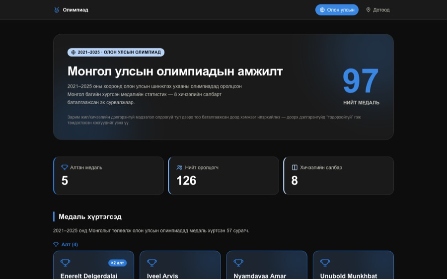
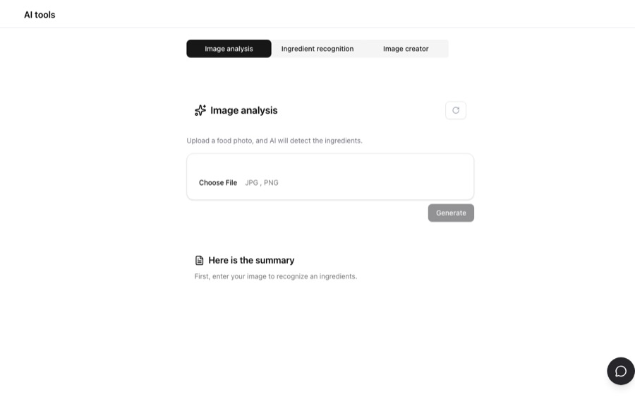

 

  

## Featured

<table>
<tr>
<td width="50%" valign="top">

<h3>MindMaze</h3>
Promotes Mongolian cultural heritage through traditional puzzle games, with an interactive 3D landing page. 
Next.js · TypeScript · Three.js 
<a href="https://mindmaze-navy.vercel.app">Live</a> · <a href="https://github.com/4nand1/MindMaze">Code</a>
</td>
<td width="50%" valign="top">

<h3>NomNom Food Delivery</h3>
Full-stack ordering app with a separate REST API, JWT auth and email notifications. 
Next.js · Express · MongoDB · Zustand 
<a href="https://food-delivery-zeta-six.vercel.app">Live</a> · <a href="https://github.com/4nand1/food-delivery">Code</a>
</td>
</tr>
<tr>
<td width="50%" valign="top">

<h3>Olympiad Results</h3>
Dashboard of Mongolia's medals at international science olympiads, 2021–2025. 
Next.js · TypeScript 
<a href="https://results-five-iota.vercel.app">Live</a> · <a href="https://github.com/4nand1/Results">Code</a>
</td>
<td width="50%" valign="top">

<h3>AI Food Tools</h3>
Upload a food photo and AI detects the ingredients. Also generates images. 
Next.js · Gemini API · Transformers.js 
<a href="https://ai-img-model.vercel.app">Live</a> · <a href="https://github.com/4nand1/AI_IMG_MODEL">Code</a>
</td>
</tr>
</table>

**More:**
[Karaoke Booking](https://github.com/4nand1/Karaoke-Booking) (Next.js, Express, MongoDB, Stripe, Clerk, Leaflet) ·
[AI Quiz Generator](https://quiz-ai-generate.vercel.app) (Gemini, Prisma, PostgreSQL, Clerk)

## Play with my contributions

<picture>
  <source media="(prefers-color-scheme: dark)" srcset="https://raw.githubusercontent.com/4nand1/4nand1/output/pacman-contribution-graph-dark.svg" />
  
</picture>

<picture>
  <source media="(prefers-color-scheme: dark)" srcset="https://raw.githubusercontent.com/4nand1/4nand1/output/galaga-contribution-graph-dark.svg" />
  
</picture>
